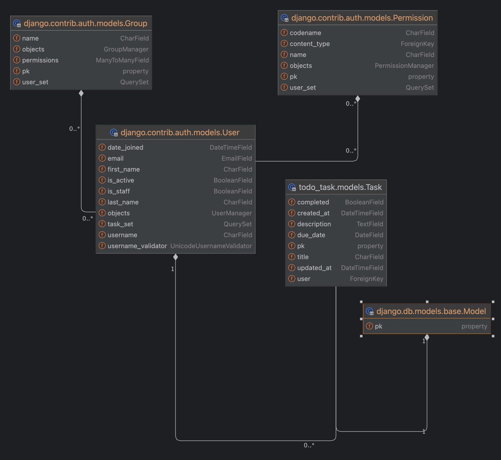

### V1.00

- V1では、allauthパッケージをオーバーライドせずに、そのまま使っています。（初めの理解のため）
- オーバーライド版は、そのうち？の予定です。
- todo_task のunittestは、todo_task/tests/ 以下にあります。
- 開始時のdbは、db.sqlite3を削除し、マイグレーションしてください。
  - pip install -r requirements.txt　　ライブラリーのインストール
  - python manage.py makemigrations　　マイグレーション
  - python manage.py migrate
  - python manage.py createsuperuser　　superuserの作成
  - ※ db：postgresqlを使いたい場合は、設定をsettings.pyにコメントで書いているので、使ってください。
  - 　　　　postgresql, mysqlは、docker/フォルダー以下に docker-compose.ymlを置いています。

### django_web_authの基本機能

- ユーザー認証 (User Authentication)
- Webアプリ： todo_task(画面:Bootstrap, タスクのCRUD機能)
- 開発環境： Django, Database(SQlite, または、PostgreSQL、MySQL)
-  Docker-compose(Databaseのみ、または、全環境（Web+App+DB)
### django_web_auth

| カテゴリ                 | 機能                                                                                                                |
| ------------------------ | ------------------------------------------------------------------------------------------------------------------- |
| ユーザー登録と認証       | - ユーザー登録 (Sign Up)  - ユーザーログイン (Login)   - ユーザーログアウト (Logout)                          |
| パスワード管理           | - パスワードリセット (Password Reset)  - パスワード変更 (Password Change)   - パスワードセット (Password Set) |
| ソーシャルアカウント認証 | - ソーシャルログイン (Social Login)  - ソーシャルアカウントのリンクとアンリンク                                  |
| アカウント管理           | - メールアドレス管理 (Email Management)  - ユーザープロファイル (User Profile)                                   |
| セッション管理           | - セッション管理 (Session Management)                                                                               |
| 多要素認証 (MFA)         | - 多要素認証 (Multi-Factor Authentication)                                                                          |
| レート制限               | - レート制限 (Rate Limiting)                                                                                        |
| 管理ツール               | - Django Adminとの統合                                                                                              |
| 国際化 (i18n)            | - 多言語対応                                                                                                        |
| 拡張とカスタマイズ       | - カスタムビューとフォーム  - シグナル                                                                           |

#### ER図

